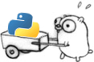

  

# Gothon 

A Python interpreter written in Go written as part of the course [*Abstract Machines* (german)](http://www.complang.tuwien.ac.at/andi/185966.html) at Vienna University of Technology.

The Go Gopher was created by [Renée French](http://reneefrench.blogspot.co.at/). The Python Logo is a [registered trademark of the Python Software Foundation](https://www.python.org/psf/trademarks/)
